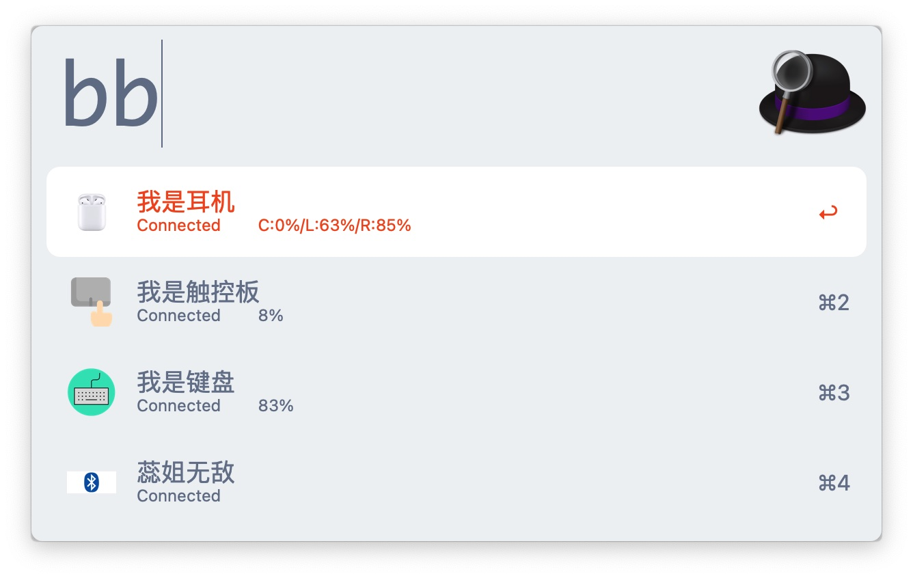

# Alfred bluetooth workflow
Alfred 4 workflow for mac bluetooth.

## Installation
1. Download latest version from [releases](https://github.com/haoguanguan/bluetooth_flow/releases)
2. Double click and install it
## Manual
1. show all device info: just input `bb`
2. push `enter` button for switch bluetooth status



## Features
1. show bluetooth device info
	status/battery/name
2. switch bluetooth status
	connect -> disconnect
	disconnect -> connect
	
## Build
```shell script
go build entry.go
```
You should download golang, and use go mod for dependency manager.
## Acknowledgement
1. I Got much information from [alfred-bluetooth-workflow](https://github.com/tilmanginzel/alfred-bluetooth-workflow)
2. I also used [blueutil](https://github.com/toy/blueutil) for quickly switch device status


