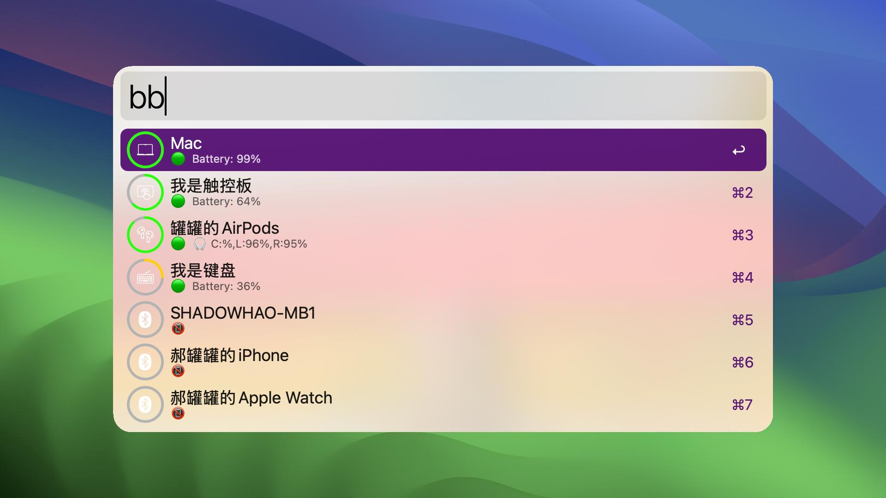
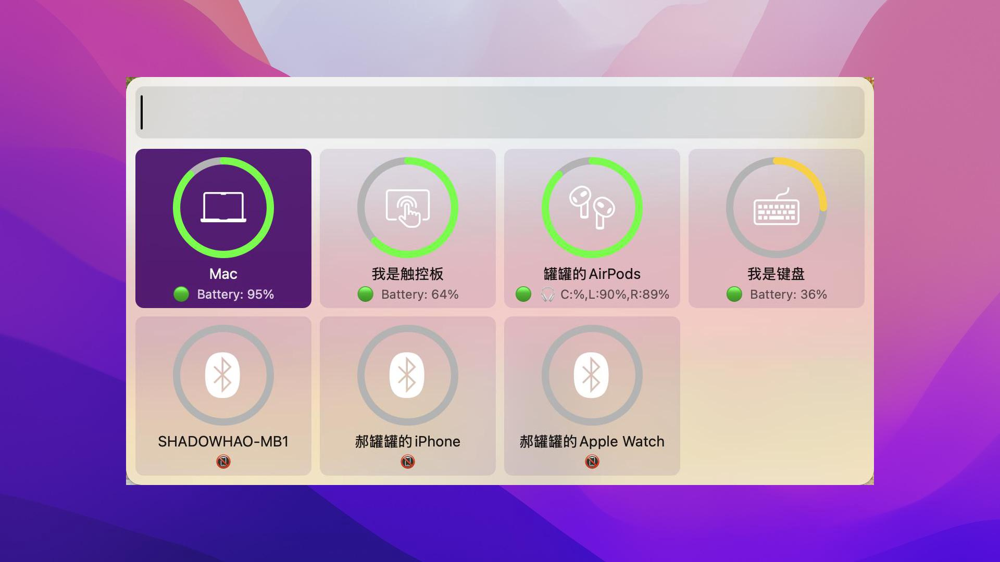
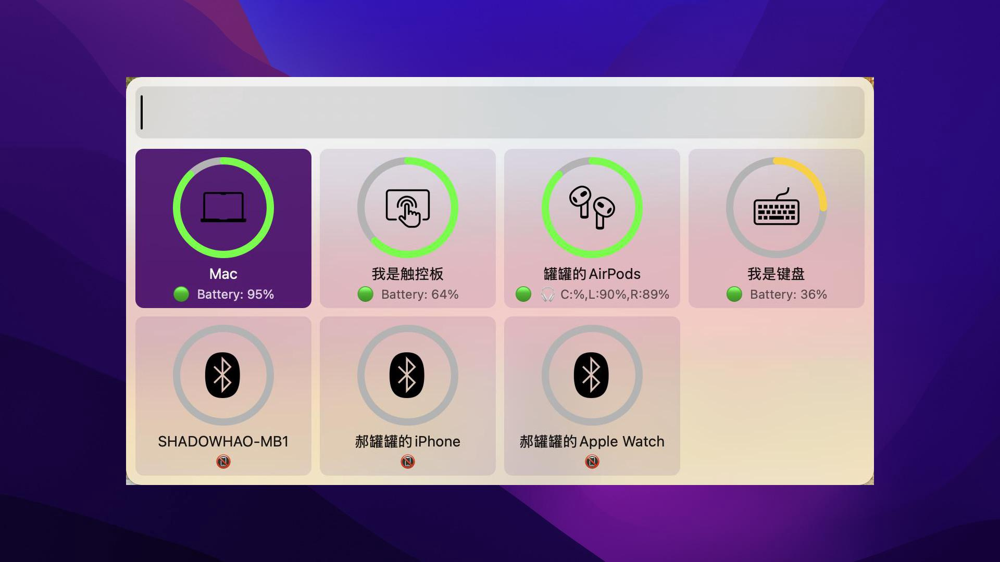

# bluetooth workflow
Alfred workflows for mac bluetooth. 🔋💎

> Due to the confusion of Apple's configuration management, the current workflow cannot meet the needs of all Bluetooth devices. If you encounter a problem that the battery status cannot be displayed, you can refer to the source code for verification. Welcome to PR.

## Installation

1. Download latest version from [release](https://github.com/o98k-ok/bluetooth_flow/releases)
2. Double click and install it

## Alfred v4

Show all bluetooth devices info.
### Usage

* light theme [white font]


* dark theme [black font]


## Alfred v5

Show all bluetooth devices info via grid.

### Usage

* light theme [white font]


* dark theme [black font]



## Customization

You can customize the icon theme of the device by editing the env `theme` in the `config`.

## Development

```shell
make
```
